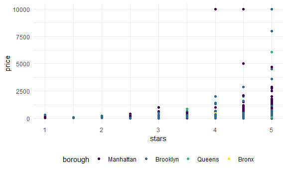

Linear models
================
Purnima Sharma
Nov 21, 2020

## Import data

``` r
data("nyc_airbnb")

nyc_airbnb = 
  nyc_airbnb %>% 
  mutate(stars = review_scores_location / 2) %>%  #recoding stars var as review scores
  rename(
    borough = neighbourhood_group,
    neighborhood = neighbourhood) %>%   # renaming these two
  filter(borough != "Staten Island") %>%  # filter out SI since not too many obs
  select(price, stars, borough, neighborhood, room_type)
```

## Fit a model (checking how the price of airbnb rental is related to stars, the borough it is in)

``` r
# doing a visual ck on relationships:
nyc_airbnb %>% 
  ggplot(aes(x = stars, y = price, color = borough)) +
  geom_point()
```

    ## Warning: Removed 9962 rows containing missing values (geom_point).


## Let’s fit the model we care about

Want to fit a line that runs through “stars”, and maybe different for
each borough(categorical predictor).

``` r
fit = lm(price ~ stars + borough, data = nyc_airbnb)
```

Let’s look at the results (these ways not much used).

Let’s look at the results better…more organized

``` r
broom::glance(fit)  # gives all useful one-number summaries, as a tibble
```

    ## # A tibble: 1 x 12
    ##   r.squared adj.r.squared sigma statistic   p.value    df  logLik    AIC    BIC
    ##       <dbl>         <dbl> <dbl>     <dbl>     <dbl> <dbl>   <dbl>  <dbl>  <dbl>
    ## 1    0.0342        0.0341  182.      271. 6.73e-229     4 -2.02e5 4.04e5 4.04e5
    ## # ... with 3 more variables: deviance <dbl>, df.residual <int>, nobs <int>

``` r
broom::tidy(fit) %>%  #output a tibble, with all coefficients(description in google doc)
  select(-std.error, -statistic) %>%  #don't need these
  mutate(
    term = str_replace(term, "borough", "Borough: ")  #anywhere there is "borough" word,replace with"Borough: "[capital B with a colon and a space], in the var "term".
  ) %>% 
  knitr::kable(digits = 3)    #put it in a nice table, round to 3 decimal places.
```

| term               | estimate | p.value |
| :----------------- | -------: | ------: |
| (Intercept)        | \-70.414 |   0.000 |
| stars              |   31.990 |   0.000 |
| Borough: Brooklyn  |   40.500 |   0.000 |
| Borough: Manhattan |   90.254 |   0.000 |
| Borough: Queens    |   13.206 |   0.145 |

## Be in control of factors

(looking at dataset, “borough” var is a character var, and very often it
gets converted to a factor var, i.e. it gets ordered in alphabetical
order. That’s why bronx, 1st in order, got to be reference borough by
default\!) So, to change reference group (let’s say picking one with
highest frequency)…

``` r
nyc_airbnb =                 #overriding dataset
  nyc_airbnb %>% 
  mutate(
    borough = fct_infreq(borough), #mutate borough to factor in order of frequency(most obs).
    room_type = fct_infreq(room_type)  #do same with room_type
  )
```

Look at plot again (with vars as factors vs characters, and ordered per
choice)

``` r
nyc_airbnb %>% 
  ggplot(aes(x = stars, y = price, color = borough)) +
  geom_point()
```

    ## Warning: Removed 9962 rows containing missing values (geom_point).



``` r
# now ordered in terms of obs, Manhattan has most obs, followed by Brooklyn, etc.
```

Look at tht linear model again

``` r
fit = lm(price ~ stars + borough, data = nyc_airbnb) 

broom::tidy(fit)  #similar result as in line 59, reference category changed though to manhattan (one with most obs)
```

    ## # A tibble: 5 x 5
    ##   term            estimate std.error statistic   p.value
    ##   <chr>              <dbl>     <dbl>     <dbl>     <dbl>
    ## 1 (Intercept)         19.8     12.2       1.63 1.04e-  1
    ## 2 stars               32.0      2.53     12.7  1.27e- 36
    ## 3 boroughBrooklyn    -49.8      2.23    -22.3  6.32e-109
    ## 4 boroughQueens      -77.0      3.73    -20.7  2.58e- 94
    ## 5 boroughBronx       -90.3      8.57    -10.5  6.64e- 26

## Diagnostics
