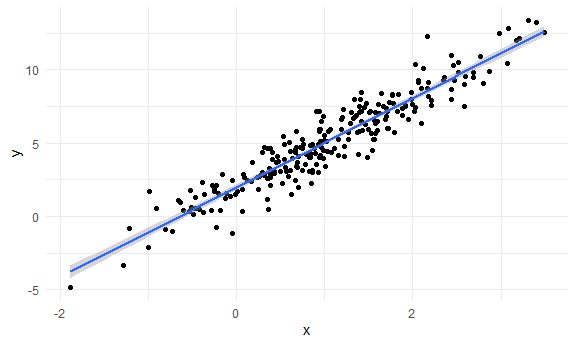
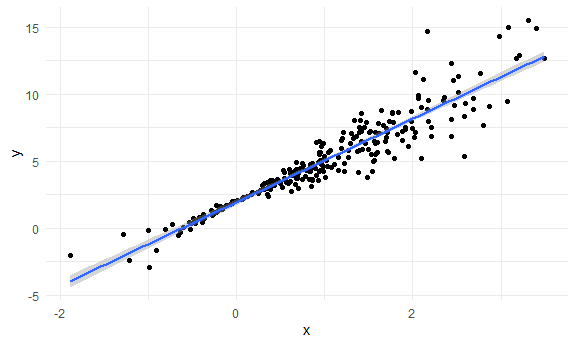
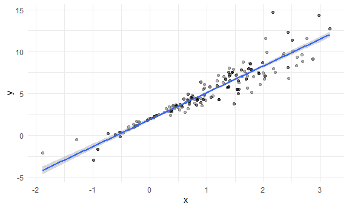

Bootstrapping
================

## Simulate data

``` r
n_samp = 250

sim_df_const =                      #1st df
  tibble(
    x = rnorm(n_samp, 1, 1),
    error = rnorm(n_samp, 0, 1),   #errors calculated from normal distr, will constant variance
    y = 2 + 3 * x + error
  )

sim_df_nonconst = sim_df_const %>%   #2nd df, with new error structure
  mutate(
  error = error * .75 * x,
  y = 2 + 3 * x + error
)
```

Plot the datasets

``` r
#1st dataset (matches all simple linear regresssion assumptions,i.e constant var)
sim_df_const %>% 
  ggplot(aes(x = x, y = y)) +
  geom_point() +
  geom_smooth(method = lm)  #also graphing geom_smooth with lm method
```

    ## `geom_smooth()` using formula 'y ~ x'



``` r
#2nd dataset (has varying residuals, because of the formula)
sim_df_nonconst %>% 
  ggplot(aes(x = x, y = y)) +
  geom_point() +
  geom_smooth(method = lm) #since linear model assumptions don't match, lm not a goodfit
```

    ## `geom_smooth()` using formula 'y ~ x'



``` r
# looking at both graphs side by side:
sim_df = 
  bind_rows(const = sim_df_const, nonconst = sim_df_nonconst, .id = "data_source") 

sim_df %>% 
  ggplot(aes(x = x, y = y)) + 
  geom_point(alpha = .5) +
  stat_smooth(method = "lm") +
  facet_grid(~data_source) 
```

    ## `geom_smooth()` using formula 'y ~ x'


fit lm to models to get estimates

``` r
lm(y ~ x, data = sim_df_const) %>% broom::tidy()
```

    ## # A tibble: 2 x 5
    ##   term        estimate std.error statistic   p.value
    ##   <chr>          <dbl>     <dbl>     <dbl>     <dbl>
    ## 1 (Intercept)     1.98    0.0981      20.2 3.65e- 54
    ## 2 x               3.04    0.0699      43.5 3.84e-118

``` r
lm(y ~ x, data = sim_df_nonconst) %>% broom::tidy()
```

    ## # A tibble: 2 x 5
    ##   term        estimate std.error statistic   p.value
    ##   <chr>          <dbl>     <dbl>     <dbl>     <dbl>
    ## 1 (Intercept)     1.93    0.105       18.5 1.88e- 48
    ## 2 x               3.11    0.0747      41.7 5.76e-114

``` r
# similar outputs for estimates (intercept, slope n std error), but since 2nd model has greater variance at some parts and less at some(in the 1st half of graph) Confidence Intervals will be inaccurate.
# Solution = Bootstrapping (getting estimates from multiple samples will give more accurate CIs)
```

## Draw one bootstrap sample (using the function to generate it)

``` r
boot_sample = function(df) {           #bootstrap sample based on a df.
  sample_frac(df, replace = TRUE)  %>%    # sample_frac function draws a sample of a particular proportion of a dataset, with replacement! 
    arrange(x)     #arrange dataset by x-value.
}
```

Check if the function works

``` r
#passing the sim_df_nonconst df into the "bootstrap" function, it draws a sample with replacement of exactly the same size. Running this each time will give a different bootstrap sample.
boot_sample(sim_df_nonconst) %>% 
#plotting it, some points will be darker because they are repeated in the sample(since with replacement) 
  ggplot(aes(x = x, y = y)) + 
  geom_point(alpha = .3) +
  stat_smooth(method = "lm")
```

    ## `geom_smooth()` using formula 'y ~ x'



running a linear regression on bootstrap sample (running it each time
will give different sample and therefore different regression and
estimates)

``` r
boot_sample(sim_df_nonconst) %>% 
  lm(y ~ x, data = .) %>% 
  broom::tidy()
```

    ## # A tibble: 2 x 5
    ##   term        estimate std.error statistic   p.value
    ##   <chr>          <dbl>     <dbl>     <dbl>     <dbl>
    ## 1 (Intercept)     1.90    0.0982      19.3 2.45e- 51
    ## 2 x               3.14    0.0688      45.6 1.18e-122
