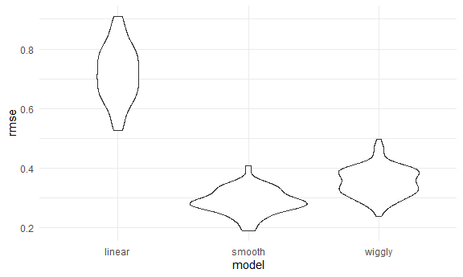

Cross Validation
================

## Simulate data

``` r
nonlin_df = 
  tibble(
    id = 1:100,
    x = runif(100, 0, 1),
    y = 1 - 10 * (x - .3) ^ 2 + rnorm(100, 0, .3)
  )
```

Look at the data

``` r
nonlin_df %>% 
  ggplot(aes(x = x, y = y)) + 
  geom_point()
```


## Cross validation - by hand (method 1)

Get training and testing datasets.

``` r
train_df = sample_n(nonlin_df, size = 80)  # set training df with a sample of n = 80.
test_df = anti_join(nonlin_df, train_df, by = "id") # anti-join function takes the remaining 20 rows and puts them in test_df, anti-join items in nonlin_df and not in train_df, by id column.

ggplot(train_df, aes(x = x, y = y)) +   # plot both df together, by different colors.
  geom_point() + 
  geom_point(data = test_df, color = "red")
```


Fit three models.

``` r
linear_mod = lm(y ~ x, data = train_df) # linear model, y against x using training_df.
smooth_mod = mgcv::gam(y ~ s(x), data = train_df)  # smooth model using mgcv package (function = gam:generalized additive model), y~s(x) means y is a smooth function of x.
wiggly_mod = mgcv::gam(y ~ s(x, k = 30), sp = 10e-6, data = train_df) # k and sp are parameters that specify smoothness, 10e_6 will tell to make smoothness close to zero!
```

Visualizing 3 models 1. Linear model

``` r
train_df %>% 
  add_predictions(linear_mod) %>%   #add-predictions function adds a column of fitted values to the linear_model.
  ggplot(aes(x = x, y = y)) +
  geom_point() + 
  geom_line(aes(y = pred), color = "red") # predictions are the y-values
```


2.  Smooth model

<!-- end list -->

``` r
train_df %>% 
  add_predictions(smooth_mod) %>%   
  ggplot(aes(x = x, y = y)) +
  geom_point() + 
  geom_line(aes(y = pred), color = "red") 
```


3.  Wiggly model (over fitted\!)

<!-- end list -->

``` r
train_df %>% 
  add_predictions(wiggly_mod) %>%   
  ggplot(aes(x = x, y = y)) +
  geom_point() + 
  geom_line(aes(y = pred), color = "red") 
```


Adding predictions for multiple models at the same time (and comparing
fits of several models at the same time)

``` r
train_df %>% 
  gather_predictions(linear_mod, smooth_mod, wiggly_mod) %>%   #"gather" is used. Models get stacked on top of each other.
  ggplot(aes(x = x, y = y)) +
  geom_point() + 
  geom_line(aes(y = pred), color = "red") +
facet_grid(. ~model)        # then use facet_grid to separate them, by model type on y-axis, "." for x-axis used as is.
```


Look at prediction accuracy of each model (by looking at rmse of testing
dataset using the models)

``` r
rmse(linear_mod, test_df)   #rmse function calculates it on the model and df given as input.
```

    ## [1] 0.7052956

``` r
rmse(smooth_mod, test_df)
```

    ## [1] 0.2221774

``` r
rmse(wiggly_mod, test_df)
```

    ## [1] 0.289051

``` r
# root mean squared error (rmse) lowest  for smooth model => best fit.
```

## Cross validation using modlr package

``` r
cv_df =          # creating a cross-validation df
  crossv_mc(nonlin_df, 100)   # cross-validation on "non_linear" df, 100 runs = drawing samples from a dataset in a repeated way.

cv_df
```

    ## # A tibble: 100 x 3
    ##    train      test       .id  
    ##    <list>     <list>     <chr>
    ##  1 <resample> <resample> 001  
    ##  2 <resample> <resample> 002  
    ##  3 <resample> <resample> 003  
    ##  4 <resample> <resample> 004  
    ##  5 <resample> <resample> 005  
    ##  6 <resample> <resample> 006  
    ##  7 <resample> <resample> 007  
    ##  8 <resample> <resample> 008  
    ##  9 <resample> <resample> 009  
    ## 10 <resample> <resample> 010  
    ## # ... with 90 more rows

What is happening here…

``` r
cv_df %>% pull(train) %>% .[[1]] %>% as_tibble() #looking at 1st list object in "train" column
```

    ## # A tibble: 79 x 3
    ##       id      x       y
    ##    <int>  <dbl>   <dbl>
    ##  1     1 0.266   1.11  
    ##  2     2 0.372   0.764 
    ##  3     3 0.573   0.358 
    ##  4     4 0.908  -3.04  
    ##  5     6 0.898  -1.99  
    ##  6     7 0.945  -3.27  
    ##  7     8 0.661  -0.615 
    ##  8     9 0.629   0.0878
    ##  9    10 0.0618  0.392 
    ## 10    11 0.206   1.63  
    ## # ... with 69 more rows

``` r
cv_df %>% pull(test) %>% .[[1]] %>% as_tibble() #similarly can look at testing dataset.
```

    ## # A tibble: 21 x 3
    ##       id      x      y
    ##    <int>  <dbl>  <dbl>
    ##  1     5 0.202   1.33 
    ##  2    12 0.177   0.836
    ##  3    19 0.380   0.982
    ##  4    22 0.212   0.710
    ##  5    28 0.382   0.932
    ##  6    31 0.482   0.498
    ##  7    37 0.794  -1.12 
    ##  8    42 0.647   0.158
    ##  9    47 0.0233 -0.148
    ## 10    56 0.0995  1.13 
    ## # ... with 11 more rows

converting all datasets of cv\_df stored as lists into tibbles.

``` r
cv_df =
  cv_df %>% 
  mutate(
    train = map(train, as_tibble),  #convert everything in train datasets as tibble.
    test = map(test, as_tibble) #map across testing datasets and convert to tibble too.
  # necessary conversion to use models functions.
  )
cv_df                
```

    ## # A tibble: 100 x 3
    ##    train             test              .id  
    ##    <list>            <list>            <chr>
    ##  1 <tibble [79 x 3]> <tibble [21 x 3]> 001  
    ##  2 <tibble [79 x 3]> <tibble [21 x 3]> 002  
    ##  3 <tibble [79 x 3]> <tibble [21 x 3]> 003  
    ##  4 <tibble [79 x 3]> <tibble [21 x 3]> 004  
    ##  5 <tibble [79 x 3]> <tibble [21 x 3]> 005  
    ##  6 <tibble [79 x 3]> <tibble [21 x 3]> 006  
    ##  7 <tibble [79 x 3]> <tibble [21 x 3]> 007  
    ##  8 <tibble [79 x 3]> <tibble [21 x 3]> 008  
    ##  9 <tibble [79 x 3]> <tibble [21 x 3]> 009  
    ## 10 <tibble [79 x 3]> <tibble [21 x 3]> 010  
    ## # ... with 90 more rows

Let’s try to fit models and get RMSEs for them.

``` r
cv_df %>%    # will try to fit linear model to every element in train column.
  mutate(
    linear_mod = map(.x = train, ~lm(y ~ x, data = .x)), #fit lm to every element of train-column, i.e. data for lm is ".x" = which is a placeholder for "train" objects. 
 
# output = a list column w/linear models, 100 of them

# doing the same with smooth_model & wiggly model:
  smooth_mod = map(.x = train, ~gam(y ~ s(x), data = .x)),
  wiggle_mod = map(.x = train, ~gam(y ~s(x, k = 30), sp = 10e-6, data = .x))
  ) %>% 
  mutate(            #checking rmse's:
    rmse_linear = map2(.x = linear_mod, .y = test, ~rmse(model = .x, data = .y)) #since 2 inputs needed(model-type and data column="test"), need map2
  )    # = output will be a column of lists that have a single value for rmse in each.
```

    ## # A tibble: 100 x 7
    ##    train         test         .id   linear_mod smooth_mod wiggle_mod rmse_linear
    ##    <list>        <list>       <chr> <list>     <list>     <list>     <list>     
    ##  1 <tibble [79 ~ <tibble [21~ 001   <lm>       <gam>      <gam>      <dbl [1]>  
    ##  2 <tibble [79 ~ <tibble [21~ 002   <lm>       <gam>      <gam>      <dbl [1]>  
    ##  3 <tibble [79 ~ <tibble [21~ 003   <lm>       <gam>      <gam>      <dbl [1]>  
    ##  4 <tibble [79 ~ <tibble [21~ 004   <lm>       <gam>      <gam>      <dbl [1]>  
    ##  5 <tibble [79 ~ <tibble [21~ 005   <lm>       <gam>      <gam>      <dbl [1]>  
    ##  6 <tibble [79 ~ <tibble [21~ 006   <lm>       <gam>      <gam>      <dbl [1]>  
    ##  7 <tibble [79 ~ <tibble [21~ 007   <lm>       <gam>      <gam>      <dbl [1]>  
    ##  8 <tibble [79 ~ <tibble [21~ 008   <lm>       <gam>      <gam>      <dbl [1]>  
    ##  9 <tibble [79 ~ <tibble [21~ 009   <lm>       <gam>      <gam>      <dbl [1]>  
    ## 10 <tibble [79 ~ <tibble [21~ 010   <lm>       <gam>      <gam>      <dbl [1]>  
    ## # ... with 90 more rows

``` r
# instead, to get a column with just rmse values replace line 165/166 with:
#   mutate(            
#    rmse_linear = map2_dbl(.x = linear_mod, .y = test, ~rmse(model = .x, data = .y))

#map2_dbl = will store just the values in a column, vs in a list first then in a column.
```

Repeating above process with smooth & wiggly models also:

``` r
cv_df = 
cv_df %>%    
  mutate(
    linear_mod = map(.x = train, ~lm(y ~ x, data = .x)), 
    smooth_mod = map(.x = train, ~gam(y ~ s(x), data = .x)),
    wiggly_mod = map(.x = train, ~gam(y ~s(x, k = 30), sp = 10e-6, data = .x))
  ) %>% 
  mutate(           
    rmse_linear = map2_dbl(.x = linear_mod, .y = test, ~rmse(model = .x, data = .y)),
    rmse_smooth = map2_dbl(.x = smooth_mod, .y = test, ~rmse(model = .x, data = .y)),
    rmse_wiggly = map2_dbl(.x = wiggly_mod, .y = test, ~rmse(model = .x, data = .y))
  )

cv_df   
```

    ## # A tibble: 100 x 9
    ##    train test  .id   linear_mod smooth_mod wiggly_mod rmse_linear rmse_smooth
    ##    <lis> <lis> <chr> <list>     <list>     <list>           <dbl>       <dbl>
    ##  1 <tib~ <tib~ 001   <lm>       <gam>      <gam>            0.675       0.298
    ##  2 <tib~ <tib~ 002   <lm>       <gam>      <gam>            0.655       0.336
    ##  3 <tib~ <tib~ 003   <lm>       <gam>      <gam>            0.785       0.295
    ##  4 <tib~ <tib~ 004   <lm>       <gam>      <gam>            0.874       0.263
    ##  5 <tib~ <tib~ 005   <lm>       <gam>      <gam>            0.784       0.250
    ##  6 <tib~ <tib~ 006   <lm>       <gam>      <gam>            0.844       0.324
    ##  7 <tib~ <tib~ 007   <lm>       <gam>      <gam>            0.791       0.274
    ##  8 <tib~ <tib~ 008   <lm>       <gam>      <gam>            0.758       0.310
    ##  9 <tib~ <tib~ 009   <lm>       <gam>      <gam>            0.621       0.287
    ## 10 <tib~ <tib~ 010   <lm>       <gam>      <gam>            0.839       0.338
    ## # ... with 90 more rows, and 1 more variable: rmse_wiggly <dbl>

What do these results say about the model choices?

``` r
cv_df %>% 
  select(starts_with("rmse")) %>%    #select rmse columns only, not tidy output, so:
  pivot_longer(
    everything(),   #pivoting all of the columns.
    names_to = "model",
    values_to = "rmse",
    names_prefix = "rmse_"   #get rid of prefixes
  ) %>%         # now wee will plot results
  ggplot(aes(x = model, y = rmse)) +
  geom_violin()      #result = smooth model has the lowest rmse
```



Compute averages

``` r
cv_df %>% 
  select(starts_with("rmse")) %>%    #select rmse columns only, not tidy output, so:
  pivot_longer(
    everything(),   #pivoting all of the columns.
    names_to = "model",
    values_to = "rmse",
    names_prefix = "rmse_"   #get rid of prefixes
  ) %>% 
  group_by(model) %>% 
  summarize(avg_rmse = mean(rmse))
```

    ## `summarise()` ungrouping output (override with `.groups` argument)

    ## # A tibble: 3 x 2
    ##   model  avg_rmse
    ##   <chr>     <dbl>
    ## 1 linear    0.718
    ## 2 smooth    0.289
    ## 3 wiggly    0.354
