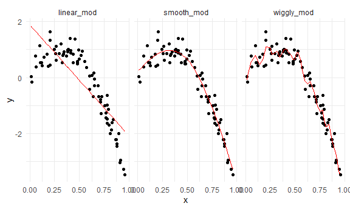

Cross Validation
================

## Simulate data

``` r
nonlin_df = 
  tibble(
    id = 1:100,
    x = runif(100, 0, 1),
    y = 1 - 10 * (x - .3) ^ 2 + rnorm(100, 0, .3)
  )
```

Look at the data

``` r
nonlin_df %>% 
  ggplot(aes(x = x, y = y)) + 
  geom_point()
```


## Cross validation - by hand (method 1)

Get training and testing datasets.

``` r
train_df = sample_n(nonlin_df, size = 80)  # set training df with a sample of n = 80.
test_df = anti_join(nonlin_df, train_df, by = "id") # anti-join function takes the remaining 20 rows and puts them in test_df, anti-join items in nonlin_df and not in train_df, by id column.

ggplot(train_df, aes(x = x, y = y)) +   # plot both df together, by different colors.
  geom_point() + 
  geom_point(data = test_df, color = "red")
```


Fit three models.

``` r
linear_mod = lm(y ~ x, data = train_df) # linear model, y against x using training_df.
smooth_mod = mgcv::gam(y ~ s(x), data = train_df)  # smooth model using mgcv package (function = gam:generalized additive model), y~s(x) means y is a smooth function of x.
wiggly_mod = mgcv::gam(y ~ s(x, k = 30), sp = 10e-6, data = train_df) # k and sp are parameters that specify smoothness, 10e_6 will tell to make smoothness close to zero!
```

Visualizing 3 models 1. Linear model

``` r
train_df %>% 
  add_predictions(linear_mod) %>%   #add-predictions function adds a column of fitted values to the linear_model.
  ggplot(aes(x = x, y = y)) +
  geom_point() + 
  geom_line(aes(y = pred), color = "red") # predictions are the y-values
```


2.  Smooth model

<!-- end list -->

``` r
train_df %>% 
  add_predictions(smooth_mod) %>%   
  ggplot(aes(x = x, y = y)) +
  geom_point() + 
  geom_line(aes(y = pred), color = "red") 
```


3.  Wiggly model (over fitted\!)

<!-- end list -->

``` r
train_df %>% 
  add_predictions(wiggly_mod) %>%   
  ggplot(aes(x = x, y = y)) +
  geom_point() + 
  geom_line(aes(y = pred), color = "red") 
```


Adding predictions for multiple models at the same time (and comparing
fits of several models at the same time)

``` r
train_df %>% 
  gather_predictions(linear_mod, smooth_mod, wiggly_mod) %>%   #"gather" is used. Models get stacked on top of each other.
  ggplot(aes(x = x, y = y)) +
  geom_point() + 
  geom_line(aes(y = pred), color = "red") +
facet_grid(. ~model)        # then use facet_grid to separate them, by model type on y-axis, "." for x-axis used as is.
```



Look at prediction accuracy of each model (by looking at rmse of testing
dataset using the models)

``` r
rmse(linear_mod, test_df)   #rmse function calculates it on the model and df given as input.
```

    ## [1] 0.7052956

``` r
rmse(smooth_mod, test_df)
```

    ## [1] 0.2221774

``` r
rmse(wiggly_mod, test_df)
```

    ## [1] 0.289051

``` r
# root mean squared error (rmse) lowest  for smooth model => best fit.
```
